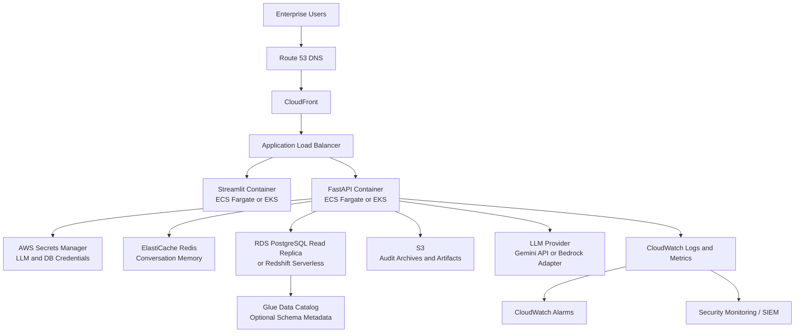
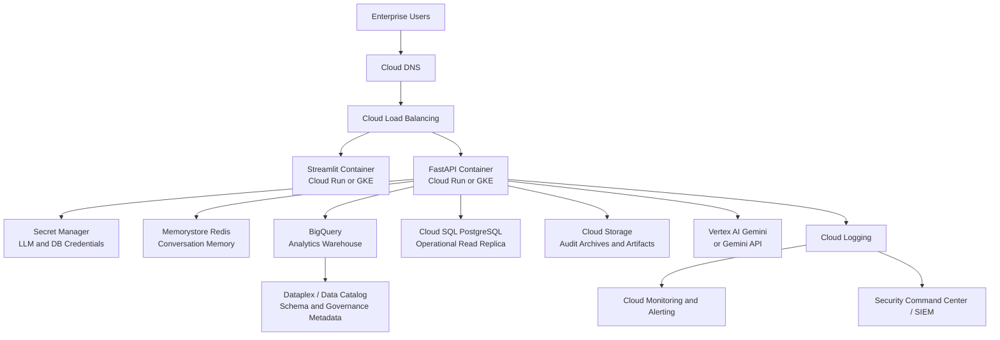

# How To Use The Enterprise AI Text-to-SQL Platform

This guide explains how to run the app locally, run it with Docker, and think about production deployment on AWS or GCP.

## What You Get

The platform has two user-facing services:

- FastAPI backend: validates prompts, generates SQL, enforces governance, executes read-only queries, and returns insights.
- Streamlit frontend: enterprise analytics workbench for asking business questions and viewing SQL, results, charts, history, schema, and workflow traces.

The default demo uses SQLite and generated enterprise sample datasets in `datasets/`.

## Option 1: Run Locally

### 1. Create A Virtual Environment

From the project root:

```powershell
python -m venv .venv
.venv\Scripts\activate
```

On macOS or Linux:

```bash
python -m venv .venv
source .venv/bin/activate
```

### 2. Install Dependencies

```bash
pip install -r requirements.txt
```

### 3. Create Demo Data

```bash
python -m sql_engine.seed
```

This creates:

- `datasets/sales.csv`
- `datasets/finance.csv`
- `datasets/operations.csv`
- `datasets/customer_analytics.csv`
- `datasets/enterprise_demo.db`

### 4. Start The API

```bash
uvicorn app.main:app --reload
```

Open API docs:

```text
http://localhost:8000/docs
```

Health check:

```text
http://localhost:8000/health
```

### 5. Start The Streamlit UI

Open a second terminal from the project root:

```bash
streamlit run frontend/streamlit_app.py
```

Open the UI:

```text
http://localhost:8501
```

### 6. Try Example Questions

Use prompts such as:

- Show top 5 revenue generating regions
- Why did sales decline in Q2?
- Compare monthly operational costs
- Find customer churn trends
- Show product-wise growth analysis
- Generate executive KPI summary
- Find anomalies in operational expenses

## Option 2: Run With Docker

### 1. Build And Start Services

```bash
docker compose up --build
```

### 2. Open The App

- Streamlit UI: `http://localhost:8501`
- FastAPI docs: `http://localhost:8000/docs`
- API health: `http://localhost:8000/health`

### 3. Stop Services

```bash
docker compose down
```

## API Usage

You can call the backend directly.

```bash
curl -X POST http://localhost:8000/api/v1/query \
  -H "Content-Type: application/json" \
  -d "{\"question\":\"Show top 5 revenue generating regions\",\"role\":\"analyst\",\"session_id\":\"demo\"}"
```

Other useful endpoints:

```text
GET /api/v1/schema
GET /api/v1/history/{session_id}
GET /api/v1/connection
GET /health
```

## Using Gemini-Compatible LLM Support

The app runs without a live LLM by default, using deterministic enterprise demo SQL generation. To enable Gemini-compatible generation:

1. Copy `.env.example` to `.env`.
2. Set:

```env
ENABLE_LLM=true
GEMINI_API_KEY=your_api_key_here
GEMINI_MODEL=gemini-1.5-flash
```

3. Restart the API.

## AWS Deployment Architecture



### AWS Production Notes

- Run containers on ECS Fargate for a simple production path, or EKS if your organization standardizes on Kubernetes.
- Use RDS read replicas, Redshift, Athena, Snowflake, or Databricks as the analytics source.
- Store API keys and database credentials in Secrets Manager.
- Use ElastiCache Redis for session memory.
- Send structured logs and audit events to CloudWatch.
- Add WAF, private subnets, IAM roles, TLS, and read-only database credentials.

## GCP Deployment Architecture



### GCP Production Notes

- Use Cloud Run for the fastest container deployment path.
- Use GKE when you need Kubernetes-native operations.
- Use BigQuery as the main analytics warehouse.
- Use Cloud SQL PostgreSQL for relational demo or operational read replicas.
- Use Memorystore Redis for memory.
- Store secrets in Secret Manager.
- Use Cloud Logging and Cloud Monitoring for observability.
- Use Vertex AI Gemini if you want managed Gemini access inside GCP.

## Recommended Production Hardening

- Replace SQLite with a read-only analytics warehouse connection.
- Add identity provider integration such as Okta, Azure AD, Google Identity, or AWS IAM Identity Center.
- Enforce row-level and column-level security in the database.
- Add query cost estimation and query timeouts.
- Add human approval workflow integration with Jira, ServiceNow, or Slack.
- Send audit logs to immutable storage.
- Export traces using OpenTelemetry.
- Add CI/CD for tests, Docker image scanning, and deployment promotion.

## Troubleshooting

### `No module named pytest`

Install dependencies first:

```bash
pip install -r requirements.txt
```

Then run:

```bash
pytest -q
```

### Streamlit Cannot Reach API

Make sure the API is running at:

```text
http://localhost:8000
```

For Docker Compose, the Streamlit service uses:

```env
API_BASE_URL=http://api:8000/api/v1
```

### Empty Results

Regenerate the demo database:

```bash
python -m sql_engine.seed
```

### Query Blocked

The SQL validator blocks unsafe or unauthorized queries. Check the validation and governance panels in the UI for the exact reason.
