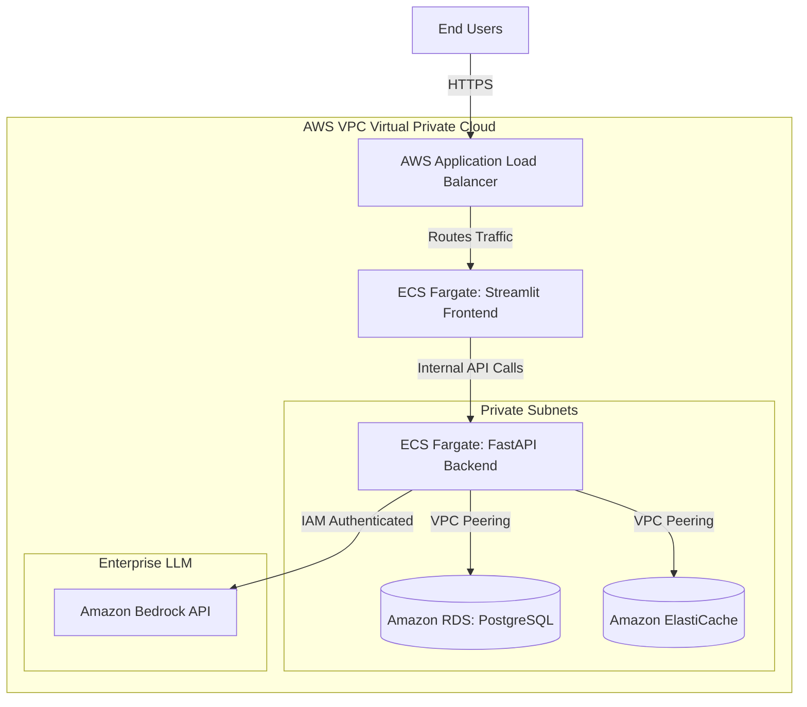
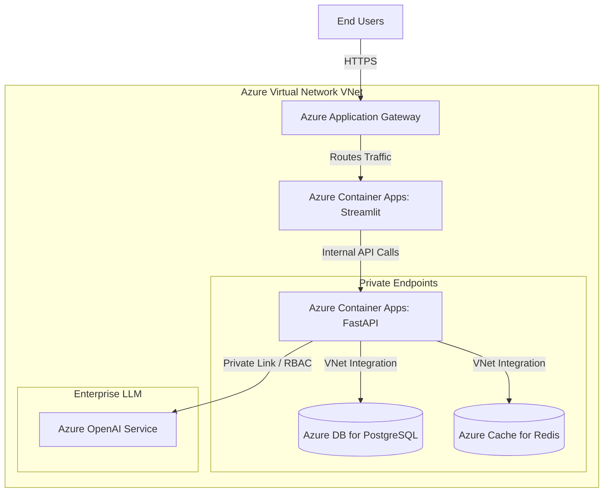

# Multi-Cloud Deployment Guide: AWS and Azure

This document outlines how the multi-agent architecture (FastAPI Backend + Streamlit Frontend + Database + Redis) maps to **Amazon Web Services (AWS)** and **Microsoft Azure**. 

Both AWS and Azure provide fully managed, scalable, and secure equivalents to the GCP architecture.

---

## 1. Amazon Web Services (AWS) Architecture

For AWS, the architecture relies heavily on **Elastic Container Service (ECS) with Fargate** for serverless compute and **Amazon Bedrock** for enterprise LLM integration.

### AWS Service Mapping
| Component | AWS Service | Description |
| :--- | :--- | :--- |
| **Frontend & Backend** | **ECS on Fargate** or **App Runner** | Serverless container execution. Fargate scales automatically without managing EC2 instances. |
| **Database** | **Amazon RDS for PostgreSQL** | Fully managed relational database securely locked inside a private subnet. |
| **Cache / Memory** | **Amazon ElastiCache (Redis)** | High-performance in-memory cache for conversation history. |
| **Load Balancer** | **Application Load Balancer (ALB)** | Routes external traffic to the frontend and provides a static entry point. |
| **LLM API** | **Amazon Bedrock** | Instead of Gemini, you can route prompts through Bedrock to models like Anthropic Claude 3 for enterprise-grade privacy (no data used for training). |

### AWS Architecture Diagram

---

## 2. Microsoft Azure Architecture

For Azure, the architecture utilizes **Azure Container Apps** for microservices orchestration and **Azure OpenAI Service** for highly secure, enterprise-grade LLM capabilities.

### Azure Service Mapping
| Component | Azure Service | Description |
| :--- | :--- | :--- |
| **Frontend & Backend** | **Azure Container Apps (ACA)** | Fully managed serverless container service built on AKS (Kubernetes) but abstracted for ease of use. |
| **Database** | **Azure Database for PostgreSQL** | Flexible Server deployment for managed PostgreSQL databases. |
| **Cache / Memory** | **Azure Cache for Redis** | Fully managed Redis instance. |
| **Load Balancer** | **Azure Application Gateway** | Web traffic load balancer providing Layer 7 routing and a public IP. |
| **LLM API** | **Azure OpenAI Service** | Allows direct access to GPT-4/GPT-4o models with strict enterprise data privacy and private VNet integration. |

### Azure Architecture Diagram

---

## 3. Key Adjustments for Deployment

If you move this project to AWS or Azure, the application code remains identical. You only need to change three configuration points:

1. **Environment Variables**: Update the database host URLs (`POSTGRES_HOST`, `REDIS_HOST`) to point to the AWS RDS/ElastiCache or Azure PostgreSQL/Redis endpoints.
2. **LLM Client (`agents/llm.py`)**: 
   - **For AWS**: Swap `langchain-google-vertexai` with `langchain-aws` (using `ChatBedrock`).
   - **For Azure**: Swap `langchain-google-vertexai` with `langchain-openai` (using `AzureChatOpenAI`).
3. **Authentication**: Use native cloud IAM (AWS IAM Roles for Tasks, or Azure Managed Identities) instead of hardcoded API keys to authenticate against the database and the LLMs securely.
