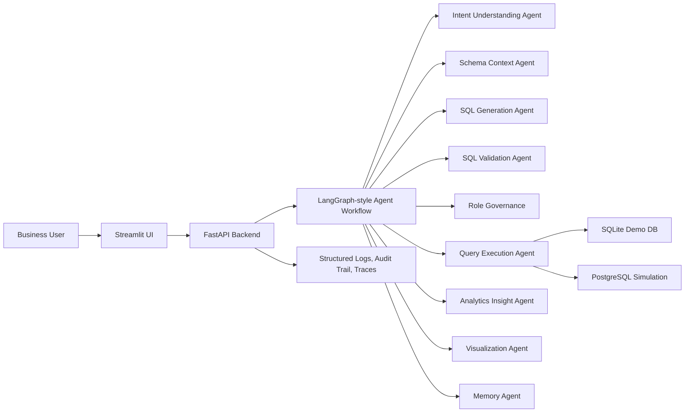

# Enterprise AI Text-to-SQL Platform

A production-inspired open-source platform that lets business users ask natural language questions over enterprise data and receive validated SQL, governed execution, business insights, visualizations, and conversational context.

This project is designed as a portfolio-grade reference architecture for Principal AI Engineers, Staff AI Engineers, AI Architects, and Enterprise GenAI Engineers. It demonstrates schema-aware prompting, agent orchestration, secure SQL execution, observability, role-based governance, and deployment-ready backend engineering.

## Enterprise Problem

Business teams often depend on analysts to translate operational questions into SQL. That slows down decision-making, creates inconsistent definitions, and can expose data platforms to unsafe ad hoc queries. This platform simulates an enterprise natural language analytics system where AI assists with query generation while the backend enforces security, governance, explainability, and traceability.

Users can ask questions such as:

- "Show top 5 revenue generating regions"
- "Why did sales decline in Q2?"
- "Compare monthly operational costs"
- "Find customer churn trends"
- "Show product-wise growth analysis"
- "Generate executive KPI summary"
- "Find anomalies in operational expenses"

## Capabilities

- Natural language to SQL generation
- Schema-aware prompting and table retrieval
- SQL validation, sanitization, and destructive-query blocking
- Read-only query execution against SQLite and PostgreSQL-style connections
- Intent understanding and query explanation
- Analytics insight generation with KPI commentary
- Plotly visualization recommendations
- Conversational memory with Redis-compatible fallback
- Role-based query governance and approval simulation
- Audit logging, tracing, token usage tracking, and execution timing
- Docker and docker-compose deployment
- Professional Streamlit interface

## Architecture



More Mermaid diagrams are available in [docs/architecture.md](docs/architecture.md) and [architecture/system-diagrams.md](architecture/system-diagrams.md).

## Agent Workflow

1. Intent Understanding Agent classifies the business question, likely KPI, time grain, filters, and visualization need.
2. Schema Context Agent ranks relevant tables and columns using semantic hints from the schema catalog.
3. SQL Generation Agent builds a read-only SQL query using either Gemini-compatible LLM output or deterministic local templates.
4. SQL Validation Agent blocks unsafe operations, validates syntax constraints, and enforces role policies.
5. Query Execution Agent executes only approved read-only SQL and captures runtime metrics.
6. Analytics Insight Agent summarizes results, trends, anomalies, and executive interpretation.
7. Visualization Agent recommends Plotly chart specs based on result shape.
8. Memory Agent records the query, SQL, trace, and outcome for conversational continuity.

## Schema-Aware Prompting

The platform builds prompts from:

- User question and conversation context
- Ranked table and column metadata
- Business descriptions and KPI semantics
- Role-based policy constraints
- SQL dialect and read-only execution rules

Prompt templates live in [configs/prompt_templates.yaml](configs/prompt_templates.yaml). The app runs without a live LLM by using deterministic enterprise demo heuristics, and can be connected to Gemini-compatible APIs through [agents/llm.py](agents/llm.py).

## Security And Governance

The SQL validation layer enforces:

- Blocked keywords: `DROP`, `DELETE`, `TRUNCATE`, `ALTER`, `INSERT`, `UPDATE`, `CREATE`, `MERGE`, `EXEC`
- Single-statement execution
- Read-only `SELECT` and `WITH` queries only
- SQL comment stripping checks
- Role-based table restrictions
- Query approval simulation for sensitive tables or broad scans
- Audit log records for every workflow

Role examples:

- `executive`: broad KPI access, no raw customer PII
- `analyst`: sales, finance, operations, and customer aggregate access
- `support`: customer analytics only, limited columns
- `finance`: finance and approved sales metrics

## Quickstart

For a full step-by-step guide, see [HOW_TO_USE.md](HOW_TO_USE.md).

```bash
python -m venv .venv
.venv\Scripts\activate
pip install -r requirements.txt
python -m sql_engine.seed
uvicorn app.main:app --reload
```

In another terminal:

```bash
streamlit run frontend/streamlit_app.py
```

API docs are available at `http://localhost:8000/docs`.

## Docker

```bash
docker compose up --build
```

Services:

- FastAPI backend: `http://localhost:8000`
- Streamlit UI: `http://localhost:8501`
- Redis: `localhost:6379`

## API Example

```bash
curl -X POST http://localhost:8000/api/v1/query \
  -H "Content-Type: application/json" \
  -d "{\"question\":\"Show top 5 revenue generating regions\",\"role\":\"analyst\",\"session_id\":\"demo\"}"
```

Example response includes:

- validated SQL
- validation status
- governance decision
- query results
- business summary
- chart recommendation
- workflow trace
- timing and token usage metrics

## Example SQL Output

Question:

```text
Show top 5 revenue generating regions
```

Generated SQL:

```sql
SELECT region, ROUND(SUM(revenue), 2) AS total_revenue
FROM sales
GROUP BY region
ORDER BY total_revenue DESC
LIMIT 5;
```

## Project Structure

```text
app/                 FastAPI app bootstrap
agents/              Modular AI agent framework
workflows/           Text-to-SQL orchestration graph
sql_engine/          Schema catalog, validation, execution, seed data
memory/              Redis-compatible memory store
frontend/            Streamlit enterprise UI
api/                 API routes and pydantic schemas
configs/             Settings, logging, prompt templates
docs/                Documentation and Mermaid diagrams
architecture/        Architecture diagrams and design notes
monitoring/          Observability guidance
deployment/          AWS-ready deployment notes
examples/            Example prompts and session output
tests/               Unit tests for safety and workflow behavior
datasets/            Realistic enterprise demo datasets
screenshots/         Placeholder for UI screenshots
```

## Observability

The platform emits structured JSON logs for:

- request lifecycle
- agent start and completion events
- SQL validation results
- governance decisions
- execution timing
- row counts
- token usage estimates
- errors and blocked queries

See [monitoring/observability.md](monitoring/observability.md).

## Deployment Guide

For production, run FastAPI behind a managed ingress, use PostgreSQL or a read replica for analytics execution, Redis for session memory, object storage for audit archives, and a centralized log backend such as CloudWatch, OpenSearch, Datadog, or Grafana Loki.

AWS-ready considerations are documented in [deployment/aws-ready.md](deployment/aws-ready.md).

## Enterprise Scalability

Recommended production extensions:

- Connect to warehouse catalogs such as Glue, BigQuery, Snowflake, or Databricks Unity Catalog
- Replace local schema ranking with vector retrieval
- Add column-level lineage and data classification
- Add tenant-aware policies
- Use read replicas and query budgets
- Add async workflow execution for long-running analytics
- Add human approval for sensitive or expensive queries
- Stream traces to OpenTelemetry

## Future Roadmap

- Native warehouse connectors
- Fine-grained row and column policies
- Prompt evaluation suite
- SQL benchmark harness
- Semantic layer integration
- OpenTelemetry exporters
- User feedback loops for generated SQL quality
- Admin console for governance rules

## License

Open-source reference implementation intended for learning, demos, and portfolio use.
