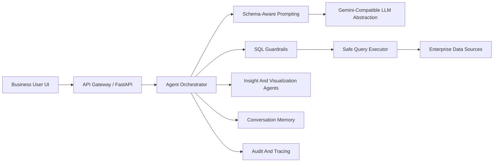
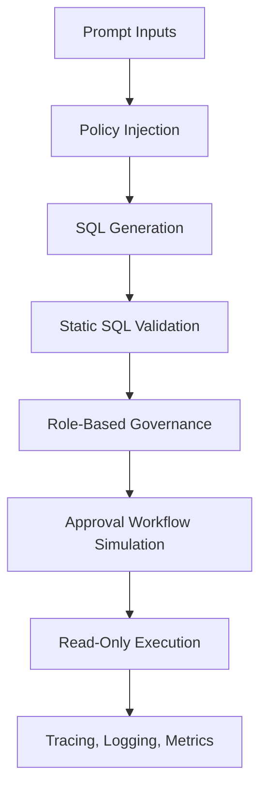

# System Diagrams

This file mirrors the core Mermaid diagrams for portfolio browsing and architecture review.

## Enterprise AI Analytics Platform

```mermaid
flowchart LR
    UI["Business User UI"] --> API["API Gateway / FastAPI"]
    API --> Orchestrator["Agent Orchestrator"]
    Orchestrator --> Prompting["Schema-Aware Prompting"]
    Prompting --> LLM["Gemini-Compatible LLM Abstraction"]
    Orchestrator --> Guardrails["SQL Guardrails"]
    Guardrails --> Executor["Safe Query Executor"]
    Executor --> Data["Enterprise Data Sources"]
    Orchestrator --> Insights["Insight And Visualization Agents"]
    Orchestrator --> Memory["Conversation Memory"]
    Orchestrator --> Audit["Audit And Tracing"]
```

## Production Control Points

```mermaid
flowchart TD
    Prompt["Prompt Inputs"] --> Policy["Policy Injection"]
    Policy --> Generation["SQL Generation"]
    Generation --> StaticValidation["Static SQL Validation"]
    StaticValidation --> RBAC["Role-Based Governance"]
    RBAC --> Approval["Approval Workflow Simulation"]
    Approval --> Execution["Read-Only Execution"]
    Execution --> Monitoring["Tracing, Logging, Metrics"]
```
