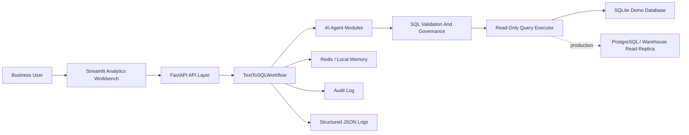
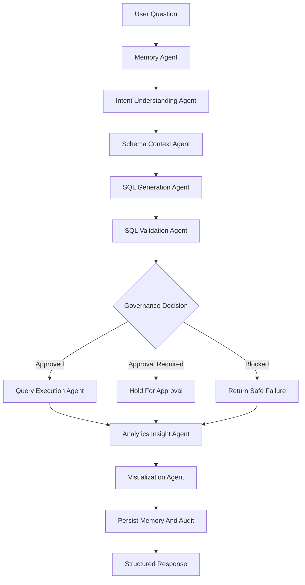
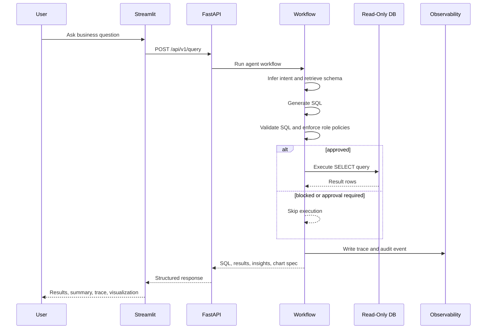
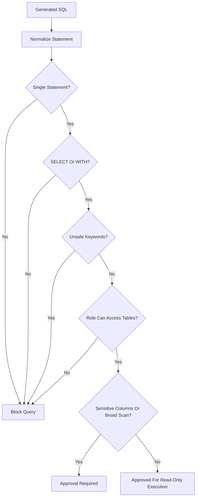
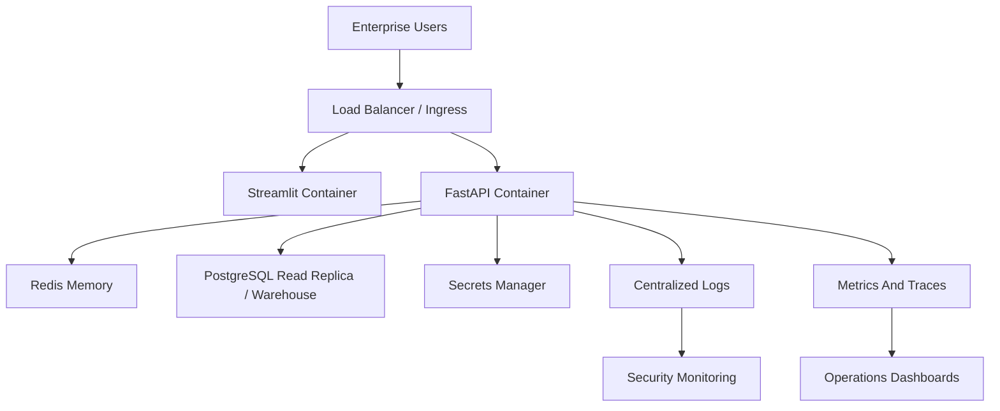

# Architecture

The Enterprise AI Text-to-SQL Platform is organized around governed agent orchestration. Each agent has a narrow responsibility, emits trace metadata, and passes structured state to the next step.

## System Architecture

## Agent Orchestration Workflow

## Query Lifecycle

## Secure SQL Validation Flow

## Deployment Architecture

## Design Principles

- Keep AI reasoning modular and observable.
- Validate before execution, every time.
- Default to read-only execution.
- Make role and approval decisions explicit.
- Treat generated SQL as untrusted until validated.
- Preserve workflow traces for debugging and governance.
